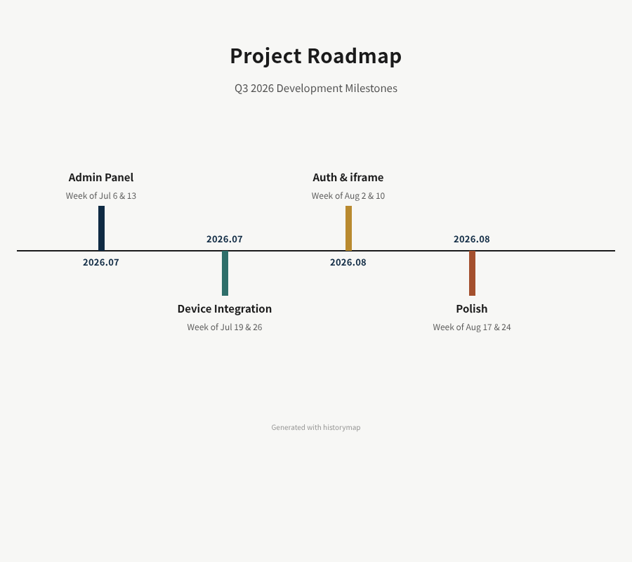

# Changelog

All notable changes to this project will be documented in this file.

Format: [Keep a Changelog](https://keepachangelog.com/en/1.0.0/)

---

## [Unreleased]

## [1.1.0] - 2026-07-14

### Added

- **MCP server** (`npm run mcp`): exposes historymap as a tool for LLM agents
  - `generate_timeline(yaml, layout?, format?, width?)` — returns HTML or PNG
  - `list_layouts()` — lists all 10 available layouts
- **PNG export** via Puppeteer (`src/screenshot.mjs`): generates a screenshot of any layout
  - Puppeteer is an `optionalDependency` — HTML output works without it
  - Override Chrome path with `PUPPETEER_EXECUTABLE_PATH` if needed
- **`mcp/handlers.mjs`**: tool logic extracted for testability
- **`VALID_LAYOUTS` export** from `src/validate.mjs`
- **14 new tests** covering MCP handlers (validation, HTML output, all layouts)

LLM agents can now generate roadmap and milestone images directly:

```yaml
# Example: pass this YAML to generate_timeline with layout=skyline
title: "Project Roadmap"
layout: skyline
items:
  - date: "2026-07-06"
    title: "Admin Panel"
    subtitle: "Week of Jul 6 & 13"
  - date: "2026-08-02"
    title: "Auth & iframe"
    subtitle: "Week of Aug 2 & 10"
```



---

## [1.0.0] - 2026-07-11

### Added

- 10 layout renderers: `zigzag`, `tree`, `metro`, `heatmap`, `snake`, `road`, `skyline`, `steps`, `beads`, `lollipop`
- `?layout=` URL query switching with allowlist redirect stub
- Layout switcher UI injected on `build:all` pages (hidden inside iframes)
- `embed.js`: `postMessage`-based iframe auto-resize for parent pages
- Schema validation with security hardening (link schemes, image path traversal, font allowlist)
- GitHub Actions deploy to GitHub Pages
- Cloudflare Workers integration for kenimoto.dev product hosting
- 79 tests across all renderers, build, embed, and multibuild
