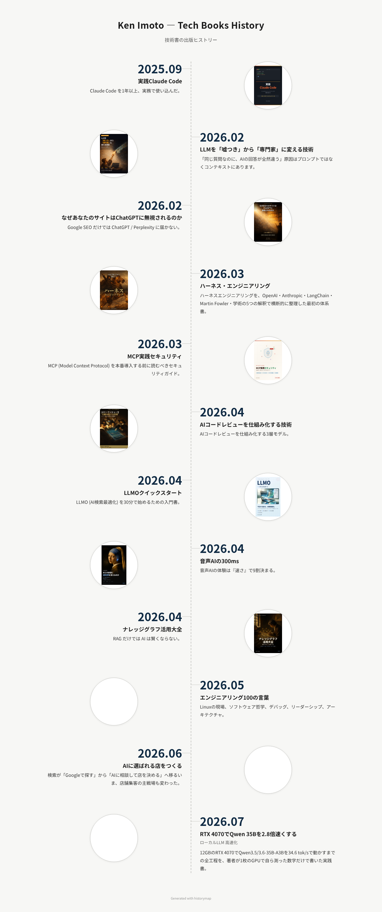
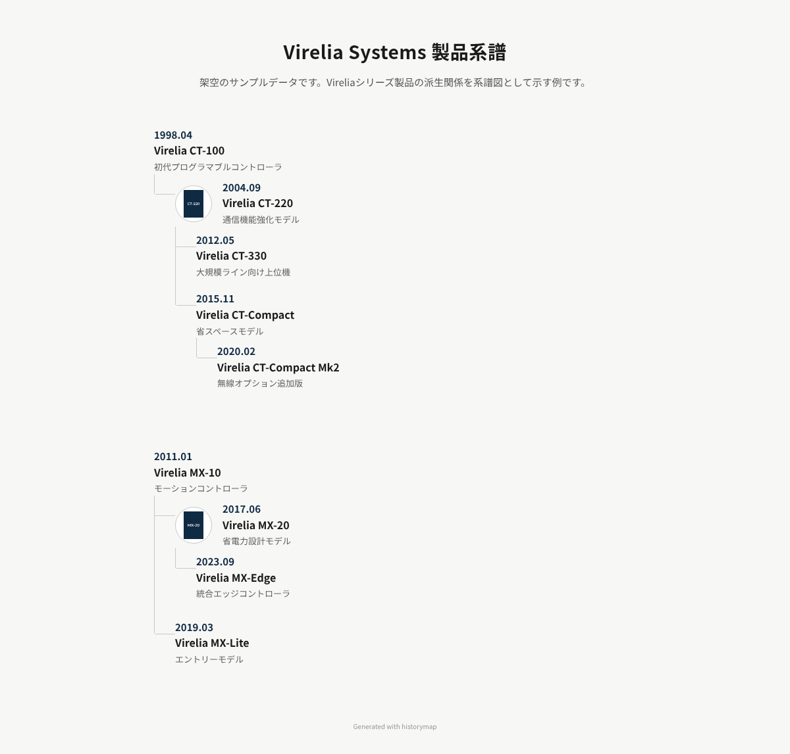
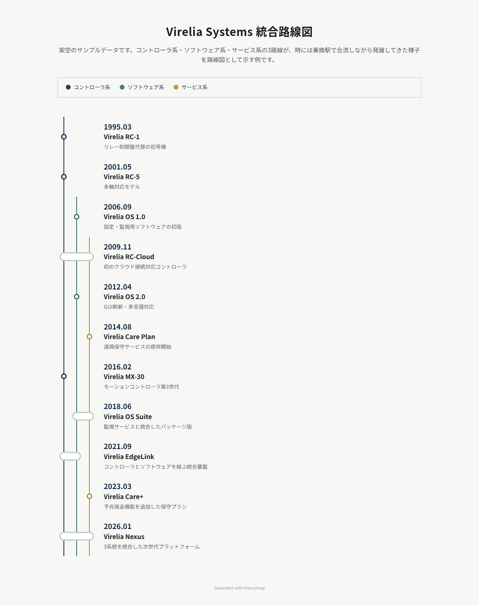
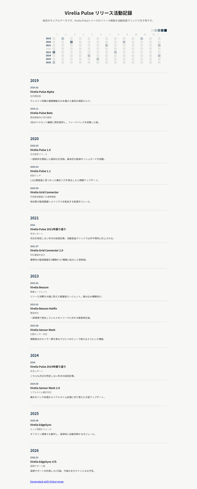
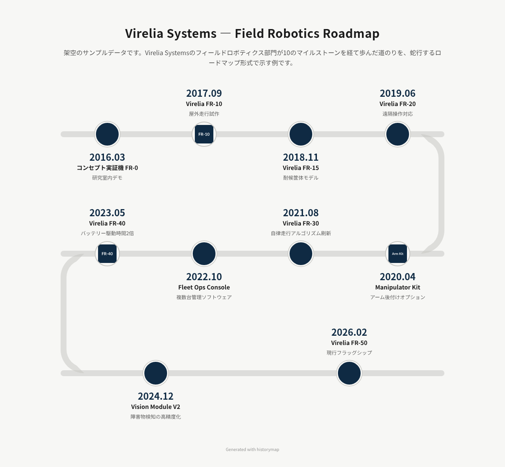
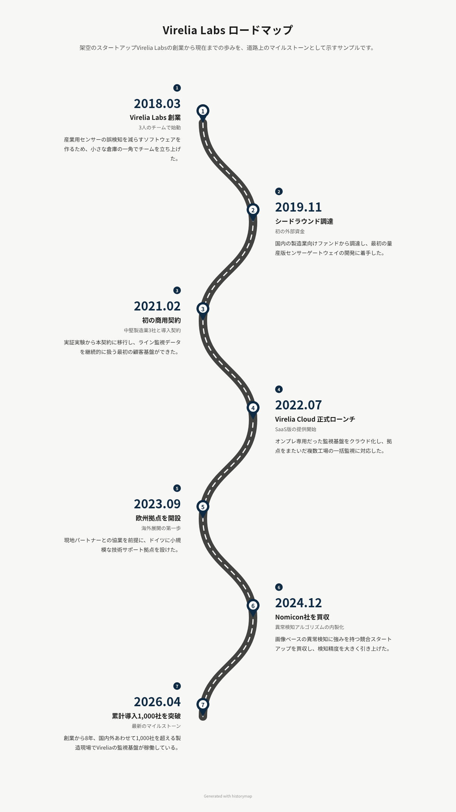
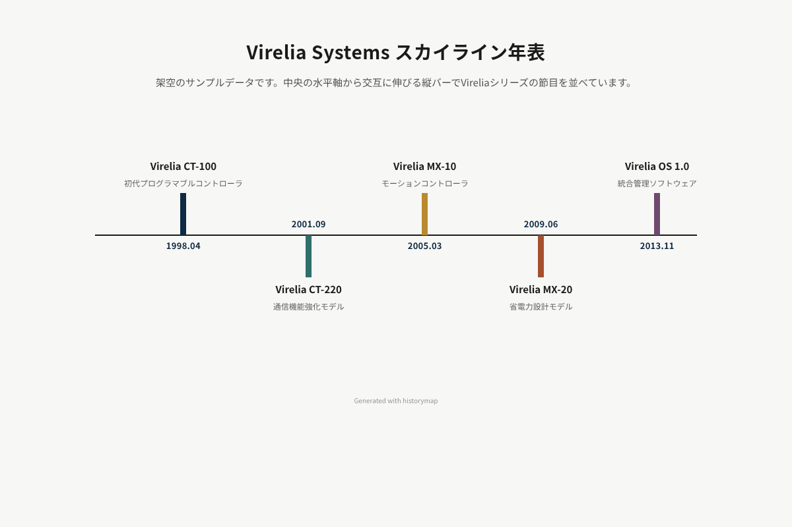
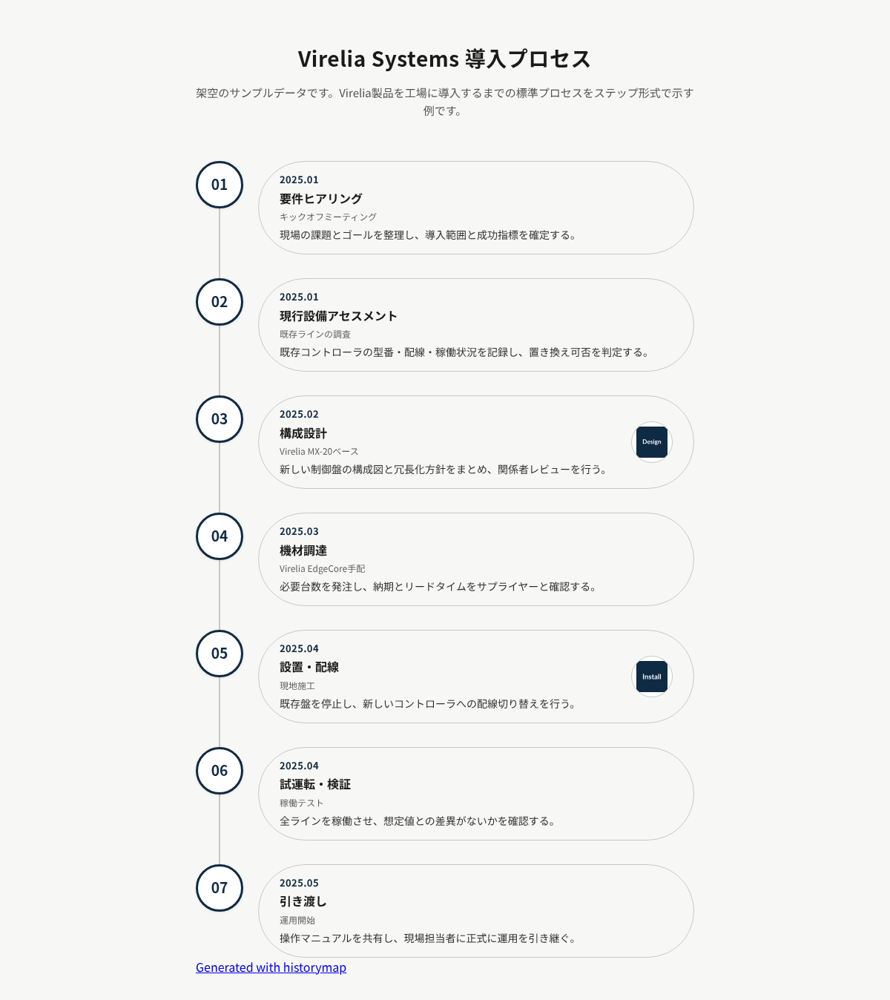
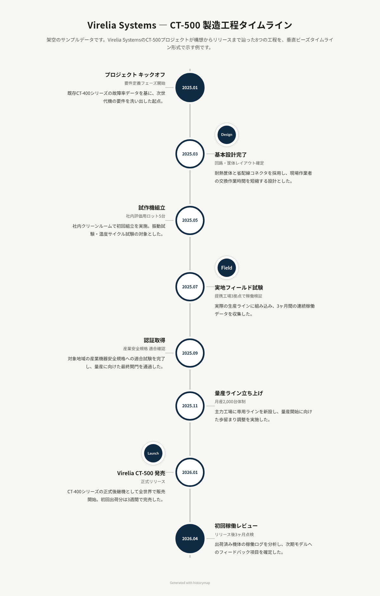
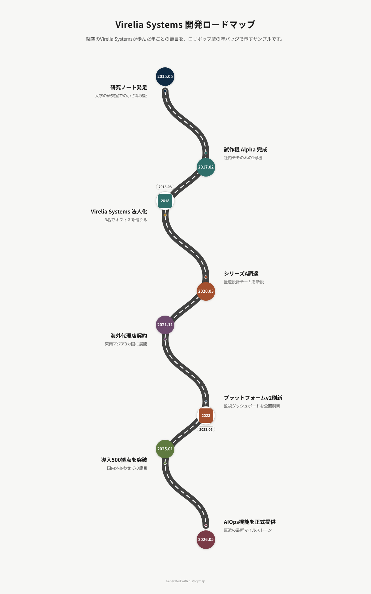

# Layout pattern gallery

historymap renders the same `data.yaml` schema into ten different layouts,
selected by the `layout:` field. This page shows what each one looks like and
when to reach for it. Every screenshot below was generated from the fictional
demo files under [`demo/`](../../demo/) — copy one as your starting point.

| Layout | Best for | Extra data it uses |
|---|---|---|
| [`zigzag`](#zigzag) | Classic corporate product history | — |
| [`tree`](#tree) | Product families that branch | `relations.parent` |
| [`metro`](#metro) | Parallel product lines that interconnect | `tags` |
| [`heatmap`](#heatmap) | Release cadence / activity density | — |
| [`snake`](#snake) | Journey-style roadmaps, curricula | — |
| [`road`](#road) | Milestone storytelling, pitch pages | — |
| [`skyline`](#skyline) | Compact overviews, dense periods at a glance | — |
| [`steps`](#steps) | Processes, onboarding flows, how-it-works pages | — |
| [`beads`](#beads) | Stage-gate processes, production pipelines | — |
| [`lollipop`](#lollipop) | Year-by-year overviews with a journey feel | — |

## zigzag

A central vertical axis with items alternating left/right, big year labels,
and circular product photos — the classic corporate "product history" page.

**Use it when:** you have one linear product lineage and want the most
conventional, instantly-readable presentation. This is the default layout.

## tree

A derivation genealogy: items with `relations.parent: <id>` hang under their
ancestor, so branches and forks in a product family are visible at a glance.
Multiple roots are supported. The build fails loudly on a reference to a
non-existent id or a circular parent chain.

**Use it when:** your history isn't a single line — a product forked into
variants, a framework spawned derivatives, or several lineages evolved in
parallel from different origins.

Data: `demo/tree.yaml`

## metro

A subway-map view: each `tags` value becomes a colored line, items are
stations in date order, and an item with several tags renders as an
interchange station spanning its lines. A legend maps line colors to tag
names. Items work without tags too (a single accent-colored line).

**Use it when:** you run several product lines, teams, or work streams at
once and want to show where they merge — hardware + software + services,
or multi-team project histories.

Data: `demo/metro.yaml`

## heatmap

A GitHub-contributions-style grid — rows are years, columns are months, cell
intensity is the number of items in that month — followed by a per-year
listing of every item. Year-only dates (`date: 2021`) land in a separate
"unknown month" column instead of silently pretending to be January.

**Use it when:** the *rhythm* matters more than individual entries — release
cadence, publication frequency, or contrasting quiet years with busy ones.
Works best with many items (a dozen or more).

Data: `demo/heatmap.yaml`

## snake

A serpentine track that runs left-to-right, U-turns at the end of the row,
and comes back — the school-curriculum "road map" poster pattern. Milestone
nodes sit on the track with labels alternating above and below; items with an
`image` show it inside the node.

**Use it when:** you want a compact "journey" feeling — onboarding paths,
learning curricula, multi-year roadmaps where the reader should sense
progress along a route rather than scan a list.

Data: `demo/snake.yaml`

## road

A winding road drawn in inline SVG — dark asphalt, dashed centerline, and
numbered drop-pins at each milestone, with text blocks alternating left and
right. The business-infographic classic, flattened to match the navy-mono
aesthetic.

**Use it when:** you're telling a founding-to-today story with a handful of
big moments — company milestones, funding history, a pitch or about page.
Best with roughly 4–8 items; each pin carries narrative weight.

Data: `demo/road.yaml`

## skyline

A horizontal axis with vertical bars rising above and dipping below it,
alternating, one color-cycled bar per item. Titles sit at the bar tips, year
labels at the base. Scrolls horizontally when there are many items; flips to
a vertical axis on mobile.

**Use it when:** you want the whole history visible in one compact band —
quick overviews, slide-style summaries, or dense stretches where card
layouts would sprawl.

Data: `demo/skyline.yaml`

## steps

Large numbered circles (01, 02, …) connected by a guide line, each paired
with a stadium-shaped pill card holding the date, title, and description.

**Use it when:** the entries are a *process* rather than a history —
onboarding sequences, deployment procedures, "how we work" pages, anything
where the reader should follow numbered stages in order.

Data: `demo/steps.yaml`

## beads

A bold vertical axis with large ring nodes threaded on it like beads — the
year sits inside each ring, and the first and last nodes are filled to mark
start and finish. Content blocks alternate left and right on short
connectors.

**Use it when:** a linear pipeline with clear start and end matters —
production processes, project phases, a product's journey from concept to
launch.

Data: `demo/beads.yaml`

## lollipop

The winding road again, but with stemmed circular year badges instead of
numbered pins — each badge carries its year (or image), color-cycled through
the palette, with just a title and subtitle beside it.

**Use it when:** you want road's journey feel but with year-at-a-glance
scannability — annual milestone recaps where the years themselves are the
headline. Prefer `road` when each milestone needs narrative text.

Data: `demo/lollipop.yaml`

